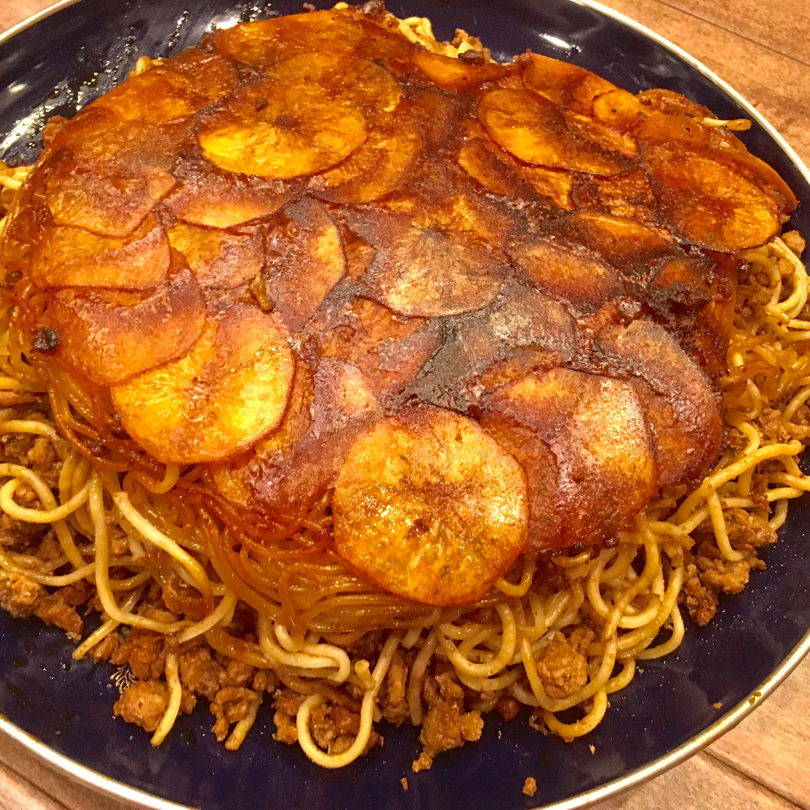
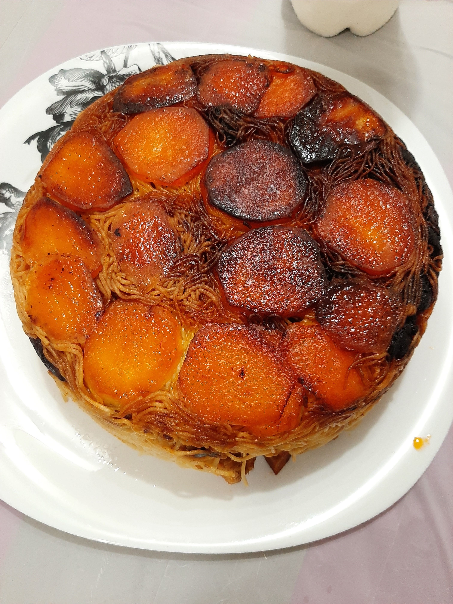
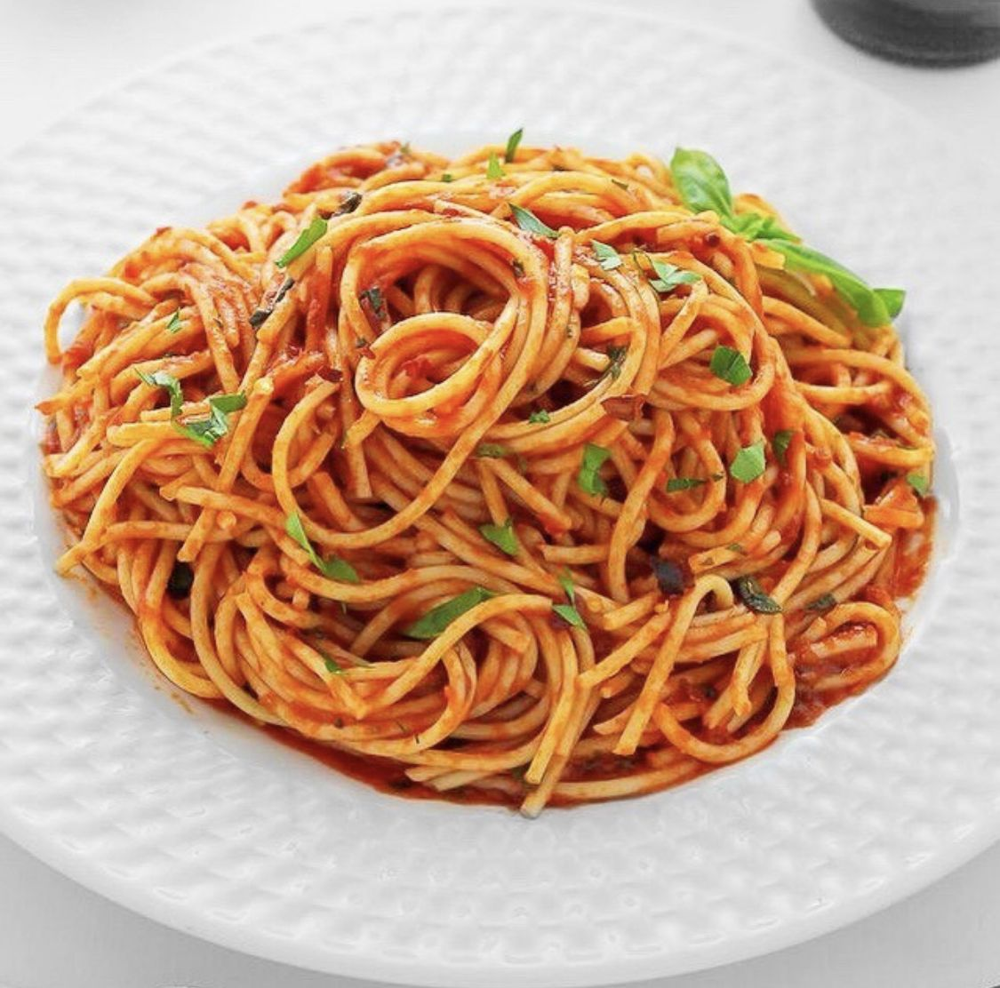
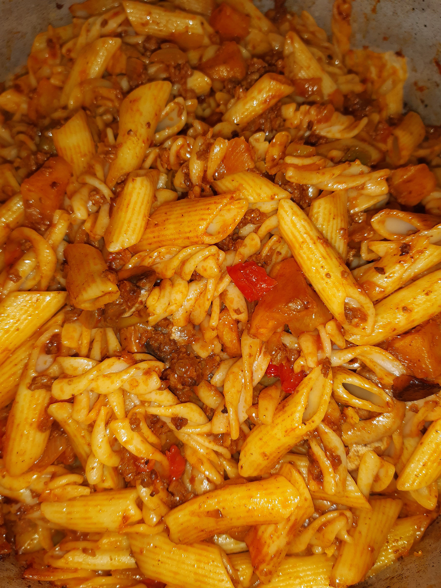
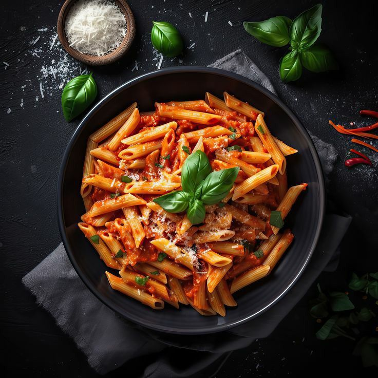
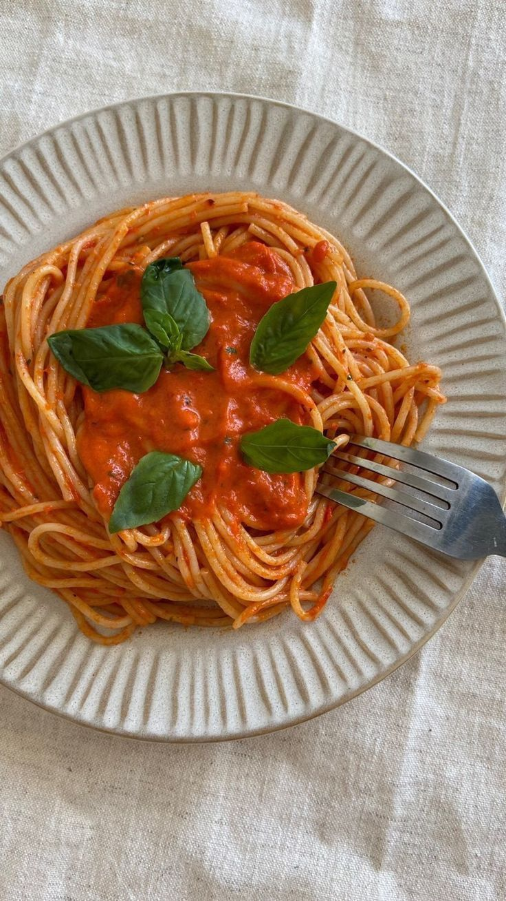
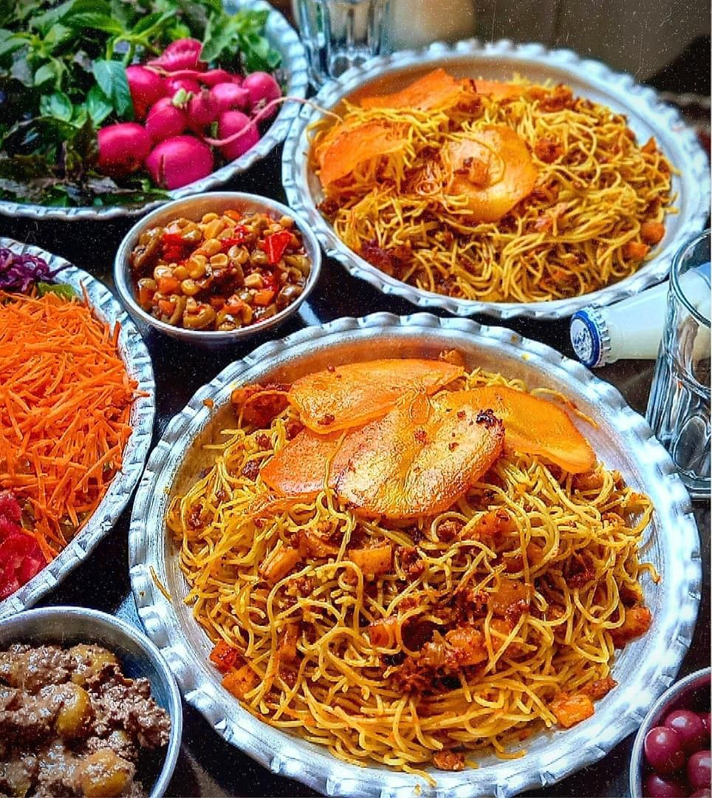
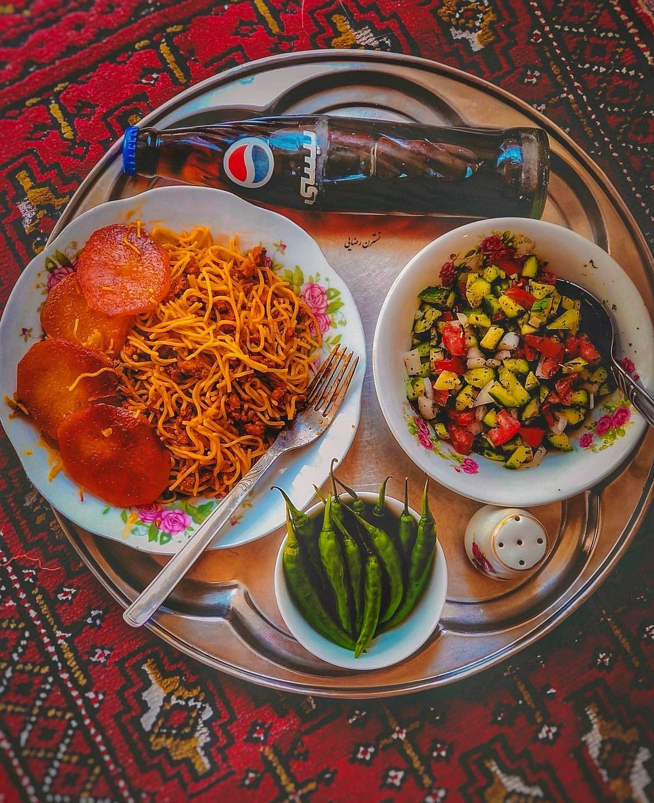
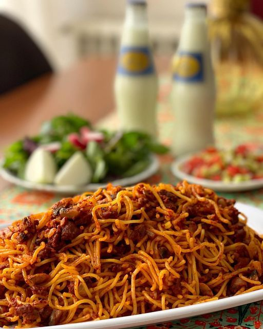

# Pinterest Workflows

Run from GitHub Actions:
- **Search**: Actions → Pinterest Search → Run workflow → Enter query
- **Download**: Actions → Pinterest Download → Run workflow → Enter URL

Results saved to `search/` and `downloads/` folders.

## Search: ماکارونی
Folder: `search/44q2vbg8`

- 
- 
- 
- 
- 
- 
- 
- 
- 
- 
